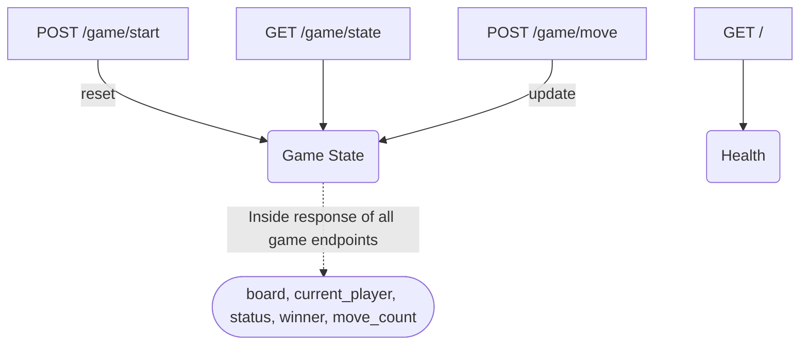

# Tic Tac Toe Backend API Contract

This document describes the API contract for the Tic Tac Toe backend implemented with FastAPI. It provides details for all REST endpoints, expected request/response formats, and the JSON game state structure for frontend and developer integration.

---

## Base URL

The backend is expected to be served at a root such as:

```
http://<backend-host>/
```

All endpoints described below are relative to this base.

---

## Endpoints Overview

| Method | URL           | Description                   |
|--------|---------------|-------------------------------|
| GET    | /             | Health check                  |
| POST   | /game/start   | Start (or reset) a new game   |
| GET    | /game/state   | Get current game state        |
| POST   | /game/move    | Submit a player move          |

---

## 1. Health Check

### GET `/`

Simple endpoint to verify the backend is running.

**Response**
```json
{
  "message": "Healthy"
}
```

---

## 2. Start or Reset Game

### POST `/game/start`

Resets the Tic Tac Toe game to a fresh initial state. Returns the initial game state.

**Request**
- Content-Type: `application/json`
- Body: _Empty object_ or `{}` (no fields currently supported, placeholder for future extensions).

**Response**
- Status 200
- Content-Type: `application/json`
- Body: [Game State JSON](#game-state-json-structure)

**Example Request**
```json
{}
```

**Example Response**
```json
{
  "board": [
    ["", "", ""],
    ["", "", ""],
    ["", "", ""]
  ],
  "current_player": "X",
  "status": "in_progress",
  "winner": null,
  "move_count": 0
}
```

---

## 3. Get Current Game State

### GET `/game/state`

Returns the current state of the game. Can be called at any time to fetch the board, status, etc.

**Response**
- Status 200
- Content-Type: `application/json`
- Body: [Game State JSON](#game-state-json-structure)

**Example Response**
```json
{
  "board": [
    ["X", "O", "X"],
    ["O", "X", ""],
    ["", "O", ""]
  ],
  "current_player": "O",
  "status": "in_progress",
  "winner": null,
  "move_count": 7
}
```

---

## 4. Make a Move

### POST `/game/move`

Records a move for the current player at the specified position. Validates the move, switches players when appropriate, and updates the game status.

**Request**
- Content-Type: `application/json`
- Body:

| Field | Type | Description        |
|-------|------|--------------------|
| row   | int  | Row index (0-2)    |
| col   | int  | Column index (0-2) |

**Example Request**
```json
{
  "row": 1,
  "col": 2
}
```

- If the move is invalid (out-of-bounds, cell occupied, or game over), returns a 400 error with a JSON error message.

**Example Invalid Move Response**
```json
{
  "detail": "Cell already occupied."
}
```

**Response**
- Status 200 if valid
- Content-Type: `application/json`
- Body: [Game State JSON](#game-state-json-structure)

**Example Valid Move Response**
```json
{
  "board": [
    ["X", "O", "X"],
    ["O", "O", "X"],
    ["X", "", ""]
  ],
  "current_player": "O",
  "status": "in_progress",
  "winner": null,
  "move_count": 8
}
```

---

## Game State JSON Structure

All game-related endpoints return the game state in a standard JSON format.

| Field           | Type                         | Description                                         |
|-----------------|-----------------------------|-----------------------------------------------------|
| board           | List[List["", "X", "O"]]    | 3x3 game board; each cell is "", "X", or "O"        |
| current_player  | "X" or "O"                  | Player whose turn it is                             |
| status          | "in_progress"/"win"/"tie"   | "in_progress", "win", or "tie"                      |
| winner          | "X", "O", or null           | Winner symbol if game is won, else null             |
| move_count      | int                          | Number of moves played so far                       |

**Example Game State**
```json
{
  "board": [
    ["X", "O", ""],
    ["O", "X", ""],
    ["", "", "O"]
  ],
  "current_player": "X",
  "status": "win",
  "winner": "X",
  "move_count": 7
}
```

---

## Error Handling

- If an error occurs (invalid move, game over, invalid payload, etc.), a response of status code 400 is returned:
    ```json
    {
      "detail": "Error message here."
    }
    ```

---

## Notes for Integration

- The backend maintains a *single, global game* for this MVP (no session or multiplayer tracking).
- The board is a list-of-lists (3 rows x 3 cols). Use indices 0, 1, 2 for both rows and columns.
- Make a move using `/game/move`, then fetch state from `/game/state` if you wish to confirm the new board.
- Calling `/game/start` at any time resets the game and overwrites the board.

---

## Quick Reference: Endpoint Summary



---

## Contact

For backend API questions or issues, consult this document first; all schemas and endpoints are defined above. For further support, contact the backend implementation team.

